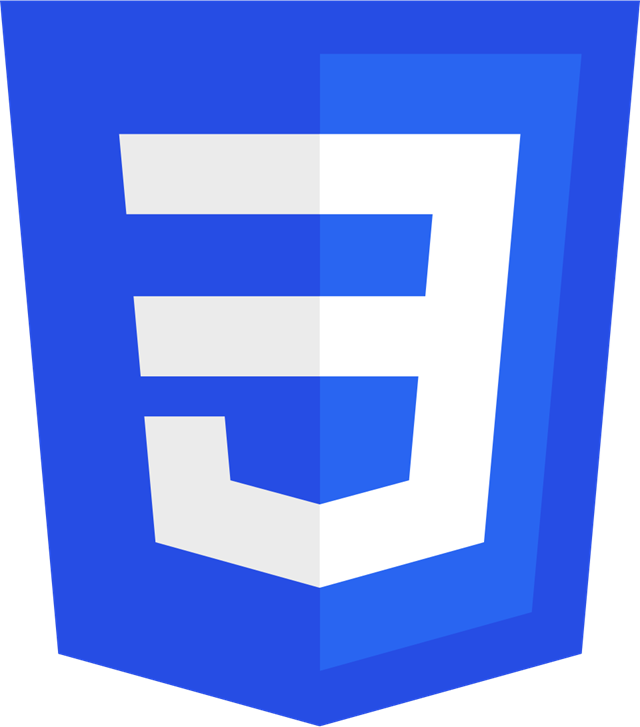
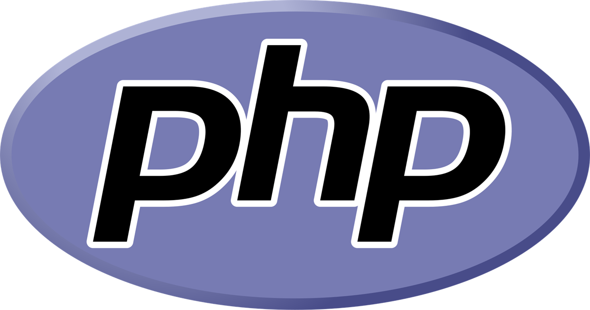
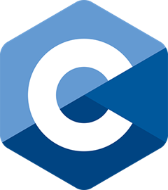
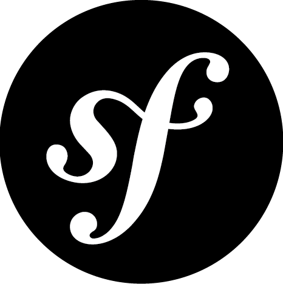

# Salut je suis Théo
Je suis étudiant en première année à [ENIGMA-SCHOOL](https://www.enigma-school.com/)

## Mes languages de programmation sont :
- Python 

- HTML 

- CSS 

- PHP 

- C 

## Et les languages en cours d'apprentisage sont :

- SQL 

- Symfony 