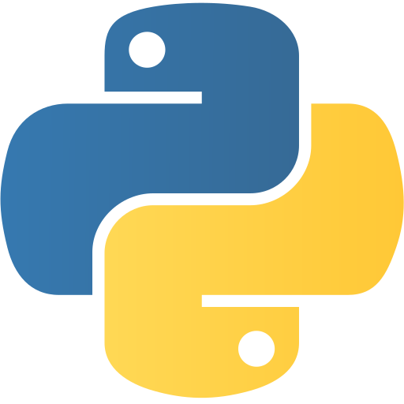
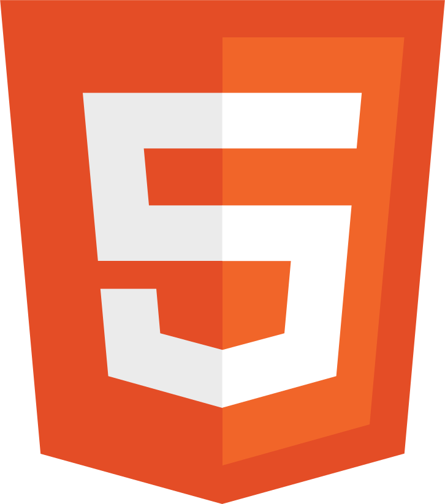
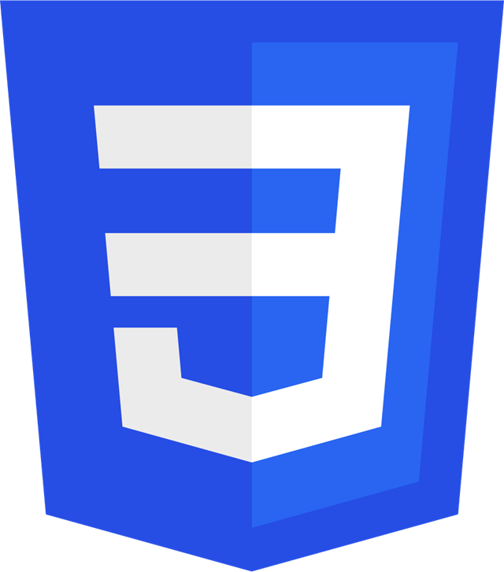
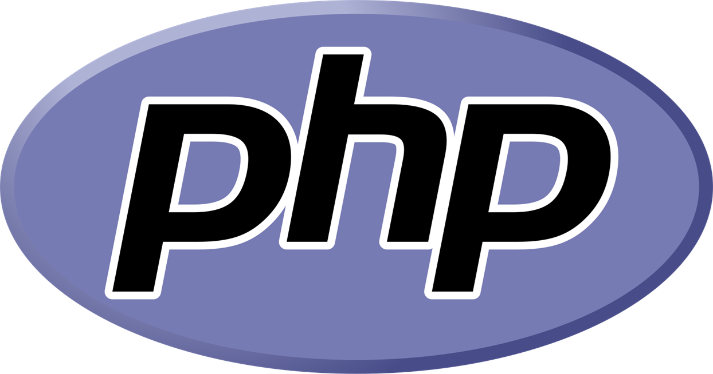
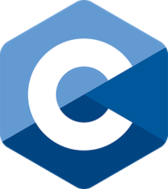
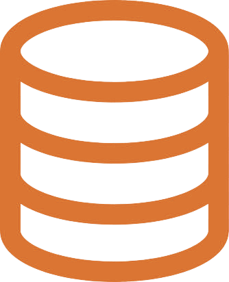

# Salut je suis Théo
Je suis étudiant en seconde année à [ENIGMA-SCHOOL](https://www.enigma-school.com/)

## Mes languages de programmation sont :
- Python 

- HTML 

- CSS 

- PHP 

- C 

## J'ai des connaissances en : 

- SQL 
